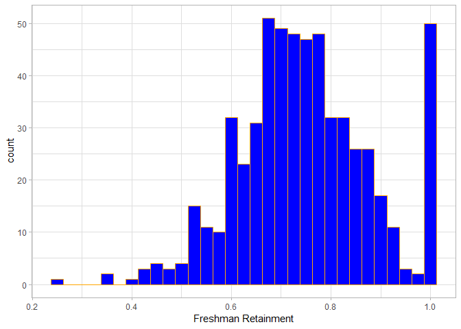
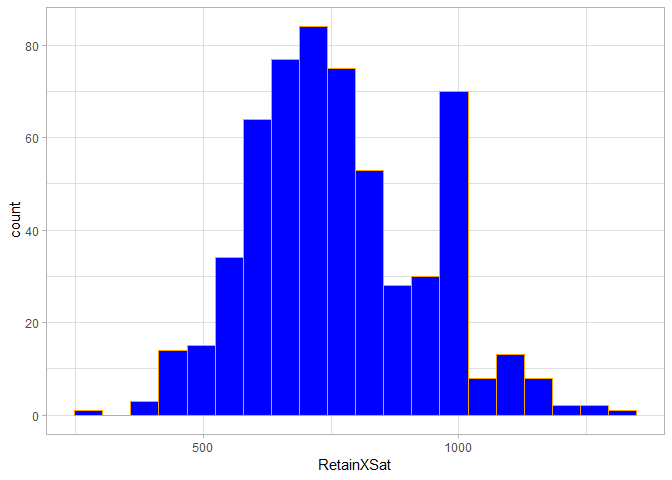

VisualizationExploration
================
Kevin Letourneau
May 22, 2019

``` r
data <- read.csv(file="C:/Users/fuses/Downloads/institution_data_R.csv",header = TRUE)
head(data)
```

    ##                   ï..institution_name
    ## 1              Alabama A&M University
    ## 2 University of Alabama at Birmingham
    ## 3 University of Alabama at Huntsville
    ## 4            Alabama State University
    ## 5     Auburn University at Montgomery
    ## 6                   Auburn University
    ##                                                basic grad_rate
    ## 1 Masters Colleges and Universities--larger programs     0.142
    ## 2 Research Universities--very high research activity     0.209
    ## 3 Research Universities--very high research activity     0.209
    ## 4 Masters Colleges and Universities--larger programs     0.116
    ## 5 Masters Colleges and Universities--larger programs     0.154
    ## 6      Research Universities--high research activity     0.215
    ##   student_count spending_per_award full_time_pct full_time_count
    ## 1          4051             105331         0.938            3906
    ## 2         11502             136546         0.727           10032
    ## 3          5696              64418         0.744            5000
    ## 4          5356             132407         0.910            5035
    ## 5          4322              58541         0.694            3571
    ## 6         19799              71999         0.910           19635
    ##   med_sat_value aid_value endow_value grad_on_time_pct pell_value
    ## 1           823      7142        3808             0.10      0.712
    ## 2          1146      6088       24136             0.29      0.351
    ## 3          1180      6647       11502             0.16      0.328
    ## 4           830      7256       13202             0.08      0.827
    ## 5           970      4327       10736             0.09      0.401
    ## 6          1215      8875       22092             0.37      0.169
    ##   fresh_retain_value full_time_fac_pct EndowXSpend PellXSat RetainXSat
    ## 1              0.631             0.828   401100448  585.976    519.313
    ## 2              0.802             0.924  3295674256  402.246    919.092
    ## 3              0.810             0.655   740935836  387.040    955.800
    ## 4              0.622             0.670  1748037214  686.410    516.260
    ## 5              0.632             0.601   628496176  388.970    613.040
    ## 6              0.895             0.887  1590601908  205.335   1087.425
    ##    AidXSat AidXEndow id
    ## 1  5877866  27196736  1
    ## 2  6976848 146939968  2
    ## 3  7843460  76453794  3
    ## 4  6022480  95793712  4
    ## 5  4197190  46454672  5
    ## 6 10783125 196066500  6

``` r
#install.packages("tidyverse")
#install.packages("gcookbook")
#install.packages("MASS")
#install.packages("ggplot2")
#install.packages("dplyr")


grad <- ggplot(data = data, aes(x=grad_rate)) +
               geom_histogram(binwidth = 0.025, bins = 20, fill = "blue", color = "orange")+
               labs(x="Graduation Rate")+
               theme_light()

grad
```


Grad rate appears to be normally distributed with a mean around 0.2 and a median around 0.2.

``` r
endow <- ggplot(data = data, aes(x=endow_value)) +
                geom_histogram(bins = 50, fill = "blue", color = "orange")+
                labs(x="Endowment Value")+
                xlim(0,40000)+
                theme_light()

endow
```

    ## Warning: Removed 11 rows containing non-finite values (stat_bin).

    ## Warning: Removed 2 rows containing missing values (geom_bar).


``` r
student <- ggplot(data = data, aes(x=student_count)) +
                  geom_histogram(bins = 20, fill = "blue", color = "orange")+
                  labs(x="Student Count")+
                  theme_light()

student
```


``` r
spending <- ggplot(data = data, aes(x=spending_per_award)) +
                   geom_histogram(bins = 25, fill = "blue", color = "orange")+
                   labs(x="Spending Per Award")+
                   theme_light()

spending
```


``` r
fullpct <- ggplot(data = data, aes(x=full_time_pct)) +
                  geom_histogram(bins = 20, fill = "blue", color = "orange")+
                  labs(x="Fulltime Student Percentage")+
                  theme_light()

fullpct
```


``` r
fullcount <- ggplot(data = data, aes(x=full_time_count)) +
                    geom_histogram(bins = 20, fill = "blue", color = "orange")+
                    labs(x="Fulltime Student Count")+
                    theme_light()

fullcount
```


``` r
medsat <- ggplot(data = data, aes(x=med_sat_value)) +
                 geom_histogram(bins = 20, fill = "blue", color = "orange")+
                 labs(x="Median SAT Score")+
                 theme_light()

medsat
```


``` r
aid <- ggplot(data = data, aes(x=aid_value)) +
              geom_histogram(bins = 30, fill = "blue", color = "orange")+
              labs(x="Aid Value")+
              theme_light()

aid
```


``` r
gradtime <- ggplot(data = data, aes(x=grad_on_time_pct)) +
                   geom_histogram(bins = 20, fill = "blue", color = "orange")+
                   labs(x="Graduating on Time")+
                   theme_light()

gradtime
```


``` r
pell <- ggplot(data = data, aes(x=pell_value)) +
               geom_histogram(bins = 20, fill = "blue", color = "orange")+
               labs(x="Pell Value")+
               theme_light()

pell
```


``` r
fresh <- ggplot(data = data, aes(x=fresh_retain_value)) +
                geom_histogram(binwidth = 0.025, fill = "blue", color = "orange")+
                labs(x="Freshman Retainment")+
                theme_light()

fresh
```



``` r
fullfac <- ggplot(data = data, aes(x=full_time_fac_pct)) +
                  geom_histogram(bins = 20, fill = "blue", color = "orange")+
                  labs(x="Full Time Faculty")+
                  theme_light()

fullfac
```


``` r
endowspend <- ggplot(data = data, aes(x=EndowXSpend)) +
                     geom_histogram(bins = 50, fill = "blue", color = "orange")+
                     xlim(0,1000000000)+
                     theme_light()

endowspend
```

    ## Warning: Removed 56 rows containing non-finite values (stat_bin).

    ## Warning: Removed 2 rows containing missing values (geom_bar).


``` r
pellsat <- ggplot(data = data, aes(x=PellXSat)) +
                  geom_histogram(bins = 20, fill = "blue", color = "orange")+
                  theme_light()

pellsat
```


``` r
retainsat <- ggplot(data = data, aes(x=RetainXSat)) +
                    geom_histogram(bins = 20, fill = "blue", color = "orange")+
                    theme_light()

retainsat 
```



``` r
aidsat <- ggplot(data = data, aes(x=AidXSat)) +
                 geom_histogram(bins = 20, fill = "blue", color = "orange")+
                 theme_light()

aidsat
```


``` r
aidendow <- ggplot(data = data, aes(x=AidXEndow)) +
                   geom_histogram(bins = 50, fill = "blue", color = "orange")+
                   xlim(0,100000000)+
                   theme_light()

aidendow
```

    ## Warning: Removed 52 rows containing non-finite values (stat_bin).

    ## Warning: Removed 2 rows containing missing values (geom_bar).


